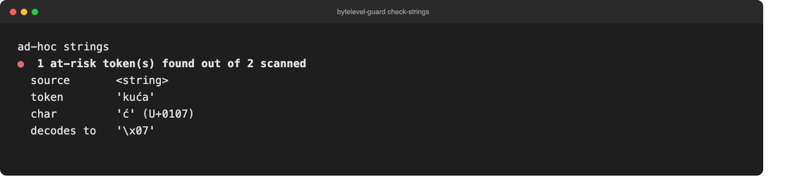

[](README.md) [](README.zh-CN.md)

# bytelevel-guard

在扩展 Hugging Face 词表前，检查自定义 token 是否存在 ByteLevel-BPE 解码损坏风险。CLI 使用 GPT-2 的字节到 Unicode 映射表，支持字符串、`tokenizer.json` 和独立的 `vocab.json`。



## 检查内容

- 扫描新增 token 和词表中的重映射字符。
- 显示字符、Unicode 码点、来源及可能错误解码出的字节。
- 提供原理说明命令和用于实际 encode/decode 往返测试的 Python helper。
- 通过非零退出码接入 CI。

相关问题见 [tokenizers#1996](https://github.com/huggingface/tokenizers/issues/1996)：新增 token 中的字面字符（如 `ć`）可能被解码成控制字节。上游 issue 已关闭，并不代表你安装的版本及添加 token 的方式一定不受影响。

`check` 仅扫描 `tokenizer.json` 中的 `added_tokens`——该问题类别仅影响绕过正常 ByteLevel 编码步骤的 token。基础词表 `model.vocab` 不会被扫描：其中大多数条目本来就合法包含字节重映射字符（例如空格标记 `Ġ`，U+0120），这是 ByteLevel-BPE 正确编码的一部分；若也扫描它们，任何真实词表都会产生误报。若传入的是独立的 `vocab.json`（不含 `added_tokens`/`model` 字段），则会检查其中每一项，因为这种格式无法区分新增 token 与基础词表。

## 安装

需要 Python 3.9+。静态扫描器没有第三方运行时依赖。建议在虚拟环境中从源码安装：

```bash
git clone https://github.com/zhuhroscar-tech/bytelevel-guard.git
cd bytelevel-guard
python3 -m venv .venv
source .venv/bin/activate
python -m pip install -e ".[dev]"
```

`dev` extra 包含 pytest 和 `tokenizers`，可测试真实后端。也可从 [Releases](https://github.com/zhuhroscar-tech/bytelevel-guard/releases) 下载 wheel；安装前请核对对应 release 的校验和。

## 快速上手

```bash
bytelevel-guard check-strings "kuća" "hello_world"
bytelevel-guard check tokenizer.json
bytelevel-guard explain
python -m pytest
```

请将 `tokenizer.json` 换成自己的文件。退出码：`0` 表示未发现风险字符，`1` 表示有发现，`2` 表示输入路径无法检查（不存在、不是常规文件、非 UTF-8 编码，或不是合法 JSON；argparse 的参数错误也使用此退出码）。

## 使用限制

这是保守的静态检查，不能单凭结果认定发生了解码损坏。基础词表本来就可能包含合法的字节重映射字符；扫描命中不等于新增 token 的往返测试失败。请使用 `bytelevel_guard.roundtrip.roundtrip_check_added_tokens()` 和[真实后端测试](tests/test_roundtrip_live.py)，检查实际词表与已安装的后端。

本工具仅覆盖 ByteLevel 字节重映射这一类问题，不检查 SentencePiece 归一化、WordPiece 偏移量或其他 tokenizer 错误，也不会修改或修复词表。

## 许可证

[MIT](LICENSE)。
